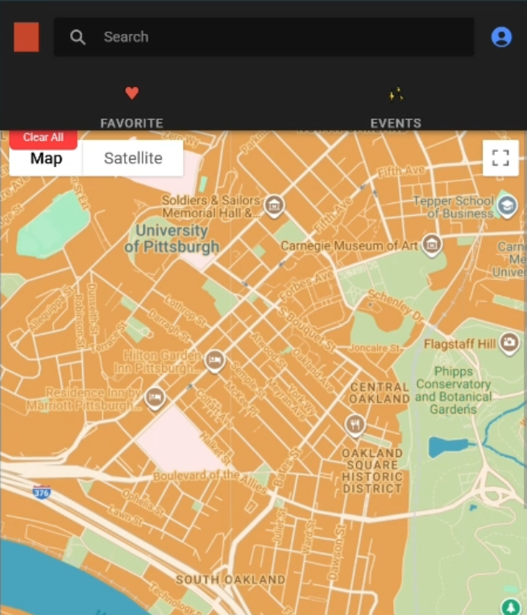
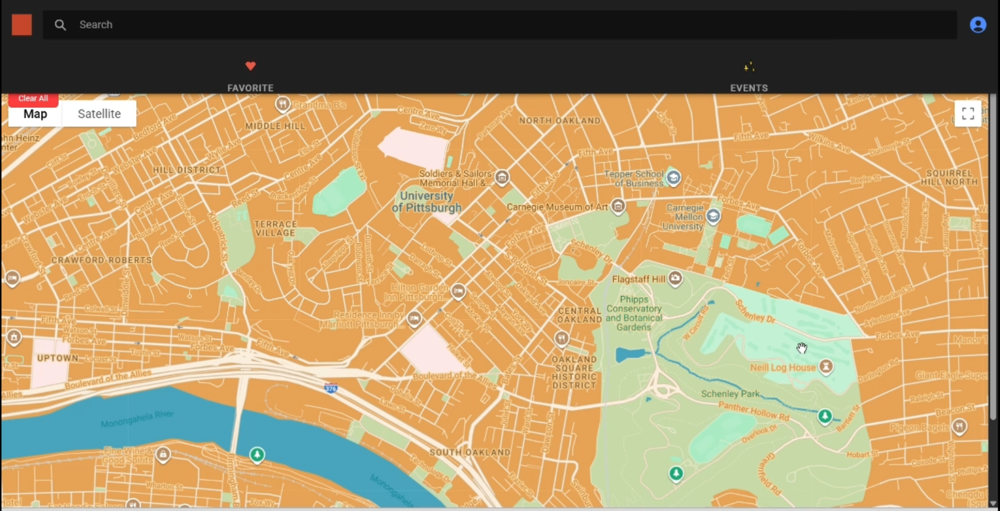
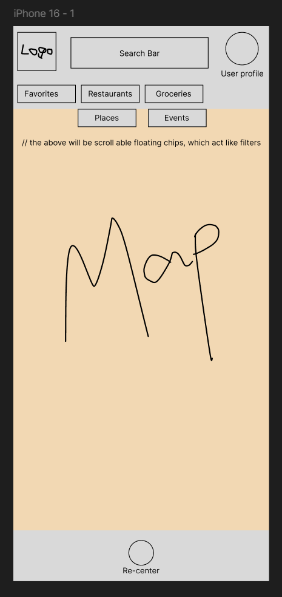
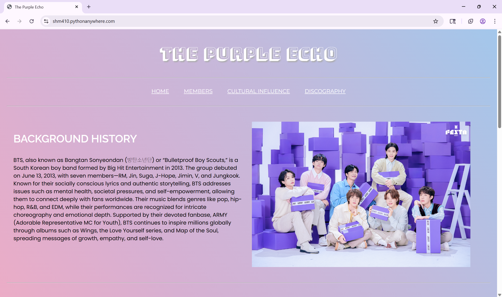
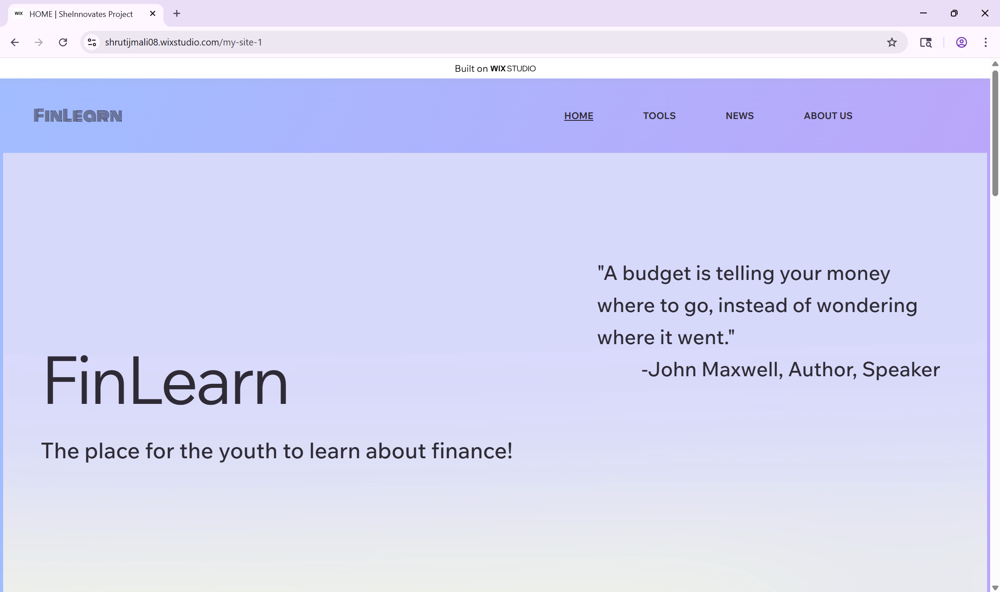
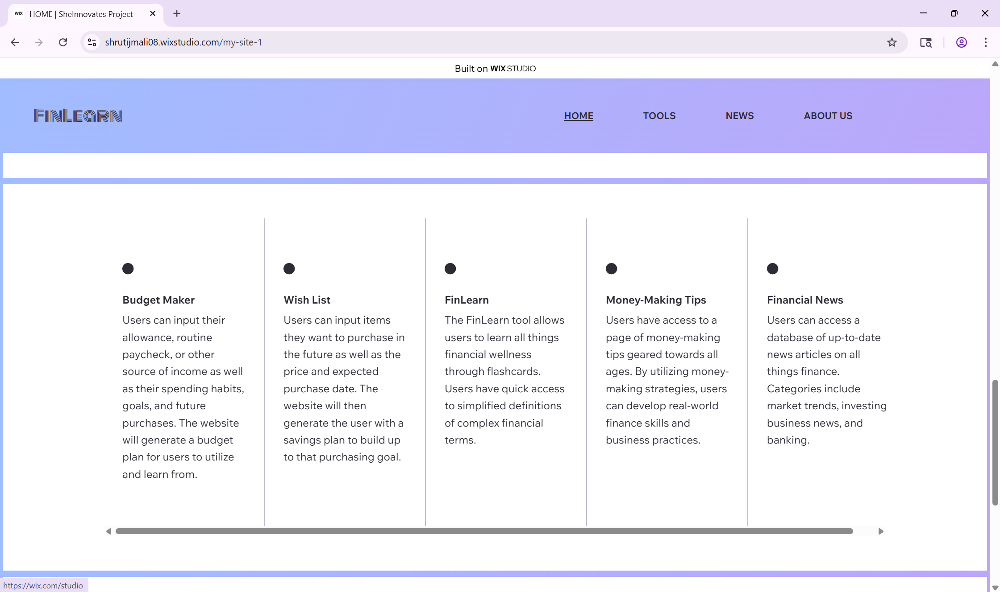
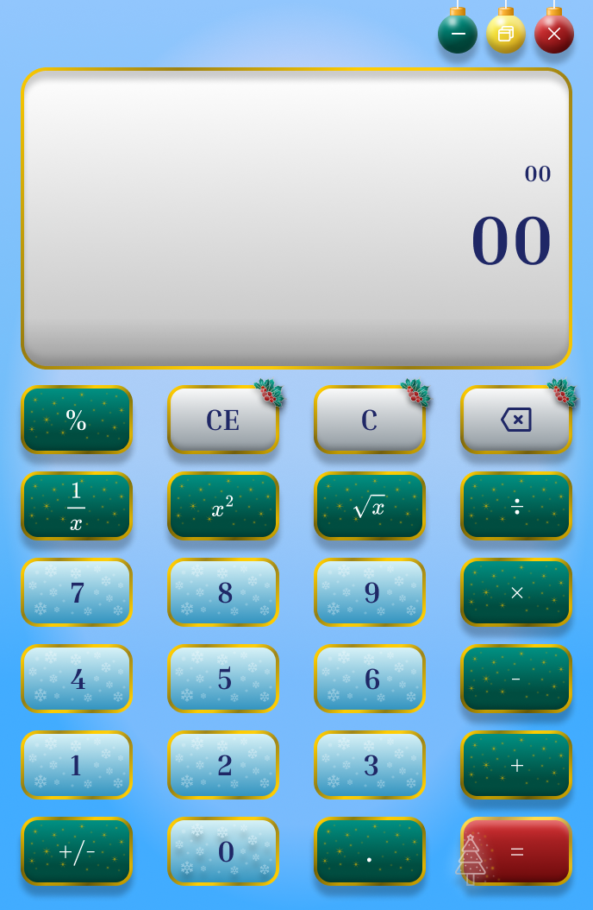
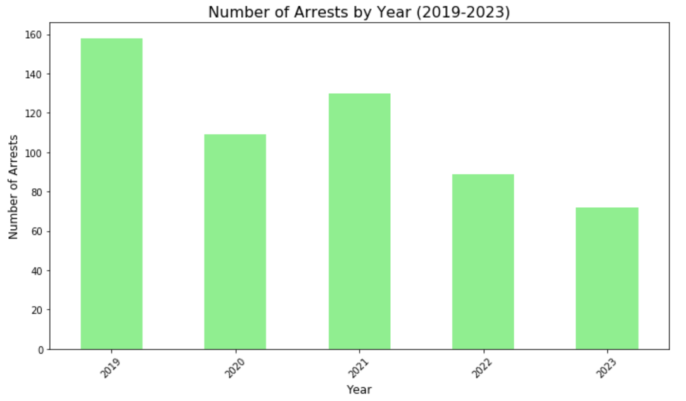

# Shruti Mali
**Software Engineer | HCI Researcher | Computer Science Graduate**   
Bridging the gap between robust Computer Science and intentional design. I specialize in building inclusive digital experiences through a blend of Human-Computer Interaction research, full-stack engineering, and applied machine learning — with recent experience taking AI-first product work from stakeholder requirements to shipped features.

## Skills

- **UI/UX & Design:** High-Fidelity Prototyping (Figma), Information Architecture (IA), Design Systems, Wireframing, Visual Storytelling, User-Centered Design (UCD)
- **Frontend Development**: JavaScript, TypeScript, HTML5, CSS3, React, Vite, Ionic Framework, Responsive Web Design, Jinja2 Templating
- **Backend & Databases**: Python (Flask), Java (Spring Boot), RESTful API
- **Database & ORM**: PostgreSQL, SQLAlchemy, JDBC,
- **Cloud & Architecture**: AWS, Docker, Microsoft Graph APIs, Microservices (awareness)
- **Data & ML**: Python (Pandas, NumPy, Jupyter), Matplotlib, Logistic Regression, Random Forest, Neural Networks
- **Tools & Methods**: Git/GitHub, Agile/Scrum, Product Management, Rapid Prototyping, Statistical Analysis, Microsoft 365/SharePoint (SPFx)

## Experience 💼

### Application Modernization Intern — Pellera Technologies (Remote)
*Jul 2025 – Aug 2025*
Contributed to the design and development of an AI-first Cloud Engineering Intranet Portal within the Microsoft 365 ecosystem.
- Translated stakeholder business requirements into structured portal workflows; integrated SharePoint, Microsoft Teams, and Microsoft Graph APIs to enhance collaboration features.
- Researched and recommended AI-driven UX improvements using Microsoft Copilot, evaluating enhancements for practical integration into the portal architecture.
- Documented technical findings and UX decisions for cross-functional knowledge-sharing.
- **Stack**: SharePoint, Microsoft Teams, Microsoft Graph API, Microsoft Copilot, Microsoft 365

### Mathematics Tutor — University of Pittsburgh (Remote)
*Nov 2025 – Apr 2026*
Conducted virtual tutoring sessions, adapting instruction to individual learning styles and tracking student progress through structured feedback.

### Summer Academic Mentor — Office of the SVC and Provost, University of Pittsburgh
*May 2025 – Jul 2025*
Facilitated one-on-one and group sessions for high school students, maintaining organized lesson materials in collaboration with instructors.

---

## Featured Projects ✨

### 1. LocAsian - Mobile UI/UX and Front-end
- Front-End Lead | Scrum Master | Product Owner  
**The Challenge**: Designing a map-based UI that feels culturally authentic rather than generic 🏮.

 
Click on the images to enlarge

<table>
    <tr>
        <th>
            Mobile Phone Preview
        </th>
        <th>
            Laptop Preview
        </th>
        <th>
            Figma Preview
        </th>
    </tr>
    <tr>
        <td>
            
        </td>
        <td>
            
        </td>
        <td>
            
        </td>
    </tr>
</table>

- 🔗 Repo: https://github.com/shruti-mali08/LocAsian-Cultural_Experiences_Map.git
- **Stack**: Ionic + React (Framework), Spring Boot (Java), MySQL, Docker, Google Maps, Snazzy Maps   
- **Key Technical & Design Insight**:
    - **Culturally Grounded Design System**: Developed a custom Google Maps interface using the Snazzy Maps tool implementing the **Wu Xing (Five Elements) Philosophy**. By mapping specific hex codes to the elements of Earth, Fire, Wood, Metal, and Water, I created a visual language that balanced aesthetics with cultural symbolism.
    - **Wireframing**: Created initial low-fidelity skeletons in Figma to map out core user interactions.
    - **Iteration**: Transitioned from wireframe to code using Ionic & React, shifting focus from structural layout to a high-fidelity visual system based on Wu Xing philosophy.
    - **Full-Stack Ownership**: Coordinated sprint planning and feature prioritization across the team while the backend ran on a containerized Spring Boot + MySQL stack via Docker.

---

### 2. DBotify — Relational Database System for Music Streaming
- Database Designer & Developer (Team Project)  
**The Challenge**: Modeling the many-to-many relationships of a real music platform — songs, artists, listeners, playlists, and listening sessions — without integrity gaps 🎧.

- **Stack**: PostgreSQL, SQL, JDBC, Java, ER Modeling, Git
- **Key Technical & Design Insight**:
    - **Schema Design**: Designed the relational schema and full ER diagram, defining primary keys, foreign keys, and alternate keys across interconnected tables.
    - **Integrity by Construction**: Implemented the database in PostgreSQL with enforced constraints, then built JDBC-based functionality to execute and manage queries against real application data.

---

### 3. The Purple Echo - Full Stack Media Archive & Single-Page Application
- Full-Stack Developer  
**The Challenge**: Transforming a decade's worth of complex cultural and discographic data into a high-performance, navigable data archive 💜.

Preview:  

- 🔗 Repo: https://github.com/shruti-mali08/the-purple-echo.git
- **Stack**: HTML/CSS, JavaScript, JSON, SQLAlchemy, Python/Flask, Jinja2   
- **Key Technical & Design Insight**:
    - **Hybrid Data Architecture**: Engineered a dual-stream system using **JSON** for static metadata and **SQLAlchemy** for persistent relational user data.
    - **Performance & Scalability**: Developed a RESTful communication layer between **Flask** and **Vanilla JS** for asynchronous updates, utilizing **Jinja2** to programmatically scale UI rendering.
    - **HCI-Driven IA**: Strategically organized a decade of cultural data into a responsive, mobile-first interface designed to minimize cognitive load and maximize discoverability.

#### 🚧 v2 — React Redevelopment (In Progress)
Currently rebuilding The Purple Echo as a React single-page application, moving from a server-rendered Flask/Jinja2 architecture to a fully client-side, component-driven one.
- **Data Layer**: Restructured member data into nested JavaScript objects (discography, awards, achievements, philanthropy, brand partnerships) with multi-tier filtering/sorting handled client-side; used `Array.prototype.toSorted()` to keep transformations immutable across rerenders.
- **Routing**: Implemented a hierarchical SPA route taxonomy with `react-router-dom` (`/solo-works/:member`, `/bts-2point0/arirang`) for deep-linkable, nested views, with a persistent `<NavBar />` scaffolded above route boundaries.
- **Reusable Components**: Built a `MemberModal` rendered via `createPortal` to avoid stacking/overflow issues, plus reusable `Carousel`, `ExpandableText` (show more/less with scroll-position restoration), and `ScrollReveal` (`IntersectionObserver`-driven) components.
- **Accessibility**: Background scroll-locking during modal display, semantic landmark structure (`<article>`, `<section>`, `<thead>`/`<tbody>`), and descriptive `alt` text sourced directly from data.
- **Stack**: React, react-router-dom, react-dom (Portals), react-icons, CSS

---

### 4. Malware Detection System — Applied Machine Learning
- Machine Learning Engineer (Team Project)  
**The Challenge**: Distinguishing malicious from benign executables using only file metadata, and proving out which modeling approach actually earns its complexity 🛡️.

- 🔗 Repo: https://github.com/shruti-mali08/malware-detection-system-ML-project
- **Stack**: Python, Logistic Regression, Random Forest, Neural Networks, Binary Cross-Entropy, Git
- **Key Technical & Design Insight**:
    - **Baseline-First Methodology**: Implemented and evaluated a Logistic Regression baseline before layering in complexity, establishing a fair benchmark for the team's ensemble model (Neural Network + Random Forest stacked with a Logistic Regression meta-learner).
    - **Rigorous Evaluation**: Owned data preprocessing and train/validation/test splitting, then compared models across accuracy, precision, recall, F1, and AUC rather than a single metric.
    - **Technical Communication**: Authored the full project report, translating model design, feature importance analysis, and experimental results into findings a non-ML audience could act on.

---

### 5. FinLearn - Financial Literacy Platform (Hackathon)
- Product Lead | UI Lead | 2nd Place (PNC Bank)  
**The Challenge**: Designing a scalable financial literacy platform from scratch in 30 hours, tailored to reduce the barrier of entry for younger users 📊.

Preview:
<table>
    <tr>
        <th>
            Hero Section & Value Proposition
        </th>
    </tr>
    <tr>
        <td>
            
        </td>
    </tr>
</table>
<table>
    <tr>
        <th>
            Service Discovery & Information Architecture
        </th>
    </tr>
    <tr>
        <td>
            
        </td>
    </tr>
</table>

- 🔗 Case Study: https://github.com/shruti-mali08/FinLearn.git
- **Stack**: Wix Studio (Development & Hosting), Custom CSS   
- **Key Technical & Design Insight**:
    - **Award-Winning Prototype**: Led a team of four to win **2nd Place** at *She Innovates* (sponsored by PNC Bank), delivering a functional MVP in a 30-hour sprint 🏆.
    - **Rapid UX Strategy**: Managed high-pressure feature prioritization to implement a real-time expense tracker, wishlist tool, and an accessibility-focused learning framework for teens.
    - **Technical Problem-Solving**: Overcame time constraints by deploying a modular design in **Wix Studio with custom CSS**, ensuring a high-fidelity visual experience.

---

### 6. Festive Logic - Christmas Calculator UI
- UI Design | Front-End  
**The Challenge**: Translating a complex, high-fidelity Figma mockup into a responsive web interface without losing visual depth or micro-textures 🎨.

Preview:
99% Layout Fidelity: From Figma to Web.
<table style="display: flex; justify-content: center; width: 50%">
  <tr>
    <th>UI Mockup (Figma)</th>
    <th>Live Implementation (HTML/CSS)</th>
  </tr>
  <tr>
    <td> 
      
    </td>
    <td>  
      
    </td>
  </tr>
</table>

- 🔗 Repo: https://github.com/shruti-mali08/festive-ui-calculator.git
- **Stack**: Figma, HTML/CSS, Google Fonts   
- **Key Technical & Design Insight**:
    - **Design-to-Code Fidelity**: Translated high-fidelity **Figma** mockups into pixel-accurate **HTML/CSS**, replicating complex gradients, inner shadows, and layer blurring.
    - **Advanced Visual Engineering**: Implemented "Micro-Textures" and a "Bleeding Technique" for icons to create a premium, jewel-toned aesthetic that simulates physical materials like frosted ice ❄️.
    - **Responsive Layout**: Utilized **CSS Grid** to maintain strict visual hierarchy and high contrast, prioritizing accessibility and layout integrity over functional logic.

---

### 7. Pittsburgh Neighborhood Crime Data Analysis
- Data Analyst  
**The Challenge**: Determining the livability of specific Pittsburgh neighborhoods by analyzing 25 years of public safety data and identifying modern trends ⚙️.

Graphs Utilized:
<figure>
    <figcaption>Monthly Arrests in Bloomfield Neighborhood (2019-2023) with Best-fit Line</figcaption>
    
</figure> 
<figure>
    <figcaption>Number of Arrests by Year (2019-2023)</figcaption>
    
</figure>

- 🔗 Repo: https://github.com/shruti-mali08/Neighborhood-Analysis.git
- **Stack**: Python (Pandas, NumPy), Matplotlib (Data Visualization), Jupyter Notebooks, WPRDC Open Data   
- **Key Technical & Design Insight**:
    - **Statistical Profiling**: Processed 63,000+ records via **Python (Pandas)** to calculate citywide safety benchmarks and identify statistical outliers, including a statistically declining arrest rate in Bloomfield (slope: -0.11, 2019–2023) 💡.
    - **Predictive Visualization**: Engineered **Matplotlib** scatter plots with linear regression to prove the downward safety trend.
    - **Data Legibility**: Transformed raw CSV logs into user-centric visual narratives, making complex public safety trends accessible to non-technical stakeholders.

---

<<<<<<< HEAD
### 8. Advancements in Technology and Human Well-being - User Research
- Honors Independent Study  
**The Challenge**: Investigating the "double-edged sword" of modern technology by analyzing its physical, psychological, and neurological impact on users aged 11-25 🔍.
=======
## Skills
- **UI/UX & Design:** High-Fidelity Prototyping (Figma), Information Architecture (IA), Design Systems, Visual Storytelling, User-Centered Design (UCD). 
- **Front-end Development**: html5, CSS3, JavaScript, React, Ionic Framework, Responsive Web Design, Jinja2 Templating.
- **Backend & Data**: Python (Flask), SQLAlchemy, JSON Data Management, Pandas, NumPy, Matplotlib (Data Visualization), RESTful APIs. 
- **Tools & Methods**: Git/GitHub, Agile/Scrum, Product Management, Rapid Prototyping, Statistical Analysis. 
>>>>>>> 1f5376cbe0520843cbd90883984b27c9c7c34340

- 🔗 Research Repo: https://github.com/shruti-mali08/Technology-and-Well-Being.git
- **Key Technical & Design Insight**:
    - **Mixed-Methods HCI Research**: Designed and administered a primary survey collecting 145 responses, and conducted a primary interview with a certified neurologist to ground findings in clinical expertise.
    - **Cognitive & Physical Analysis**: Identified behavioral correlations between social media use and adolescent insecurity (60% reported increased insecurity), attention span decline, and disrupted dopamine/serotonin regulation.
    - **Ethical Advocacy**: Synthesized primary and secondary research to produce actionable recommendations for intentional, mindful technology use.

---

### 9. Comparative Study: GDPR vs. Asian Privacy Laws
- Researcher  
**The Challenge**: Understanding whether China's PIPL and India's DPDPA reproduce GDPR principles or reflect a distinct regional governance model — and what that means for culturally aware technology design ⚖️.

> ❗**Confidentiality Note**: This research is currently **unpublished**. The full report and presentation deck are available for review [upon request](mailto:shrutijmali08@gmail.com) during the interview process to protect the integrity of the study.
- **Key Technical & Design Insight**:
    - **Comparative Policy Analysis**: Analyzed three major data protection frameworks (GDPR, PIPL, DPDPA) across legal, political, and cultural dimensions.
    - **Theoretical Synthesis**: Applied the "Brussels Effect" and regional governance literature to argue that Asian privacy law reflects a distinct regional approach rather than passive GDPR imitation.
    - **HCI Connection**: Connected legal findings to HCI and culturally aware technology design principles — directly informing how I think about consent, data, and trust in the products I build.

---
## Contact
[LinkedIn](https://www.linkedin.com/in/shruti-j-mali/) | shrutijmali08@gmail.com